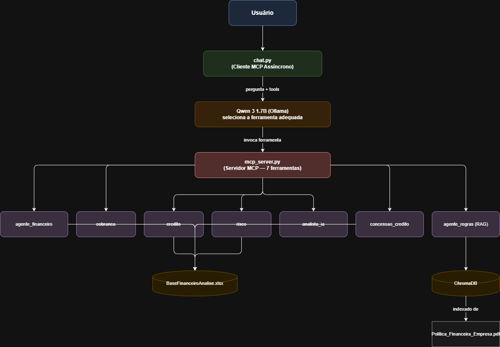

# Análise de Risco Financeiro com Arquitetura Multiagente e Modelos Locais

## Integrantes da Equipe

* Matheus Soares Oliveira da Silva (191045)
* Vitória Aparecida dos Santos (202881)


# 1. Descrição do Problema

Empresas precisam analisar constantemente sua carteira de clientes para identificar inadimplência, riscos financeiros, necessidade de cobrança, concessão de crédito e oportunidades de renegociação.

Realizar essas análises manualmente demanda tempo e aumenta a possibilidade de erros.

Este projeto propõe uma solução baseada em Inteligência Artificial Multiagente para auxiliar a análise financeira e a tomada de decisão.


# 2. Objetivo da Solução

Desenvolver uma aplicação baseada em múltiplos agentes inteligentes capazes de cooperar para analisar informações financeiras, consultar documentos corporativos e responder perguntas em linguagem natural.

A solução utiliza modelos locais de linguagem executados via Ollama, integração MCP (Model Context Protocol) para orquestração das ferramentas e uma arquitetura RAG para consulta de documentos financeiros.


# 3. Arquitetura da Solução

A arquitetura é baseada no protocolo MCP, onde um servidor central expõe as capacidades dos agentes como ferramentas padronizadas. O modelo de linguagem, executado localmente via Ollama, decide autonomamente qual ferramenta invocar para cada pergunta do usuário.



Fluxo de execução:

```
Usuário (chat.py)
↓
Cliente MCP Assíncrono (chat.py)
  └─ Envia pergunta + lista de ferramentas disponíveis ao Qwen
↓
LLM Qwen 3 1.7B seleciona a ferramenta adequada
↓
Servidor MCP (mcp_server.py)
  └─ Invoca o agente especializado correspondente
↓
Agente Especializado
  └─ Consulta Excel / ChromaDB
↓
Resultado retorna ao Qwen para geração da resposta final
↓
Resposta em português exibida ao usuário
```

O módulo `chat.py` é um cliente MCP assíncrono que:
- Inicia o `mcp_server.py` como subprocesso via `StdioServerParameters`
- Converte as ferramentas MCP para o formato de ferramentas do Ollama
- Gerencia o histórico da conversa com suporte a múltiplos turnos
- Remove automaticamente as tags `<think>` geradas pelo Qwen 3

Um prompt de sistema garante que o modelo:
- Responda sempre em português
- Não fabrique dados ou nomes de clientes
- Baseie as respostas exclusivamente nos resultados das ferramentas invocadas


# 4. Agentes do Sistema

## 4.1 Coordenador

Módulo auxiliar de roteamento baseado em palavras-chave.

Identifica o tipo de pergunta e a direciona ao agente mais adequado com base em termos como "conceder", "inadimplente", "saldo", "risco", entre outros.

Observação: no fluxo principal via MCP, o roteamento é realizado diretamente pelo modelo Qwen ao selecionar a ferramenta adequada. O coordenador permanece disponível como alternativa.


## 4.2 Agente Financeiro

Responsável por consultas financeiras individuais e gerais.

Capacidades:
* Consultar saldo de um cliente pelo nome (busca parcial e insensível a maiúsculas).
* Retornar o total de saldo aberto da carteira.
* Identificar quantidade de registros com atraso.

Colunas utilizadas: `Nome_Cliente`, `Saldo_Aberto`, `Situacao`.


## 4.3 Agente de Cobrança

Responsável por identificar clientes com status de inadimplência.

Retorna lista formatada de clientes com situação `Atrasada`, incluindo nome e saldo devedor.


## 4.4 Agente de Crédito

Responsável pela análise de utilização de limite de crédito.

Identifica clientes que utilizam 80% ou mais do limite disponível, calculando o percentual de utilização para cada um.

Colunas utilizadas: `Nome_Cliente`, `Saldo_Aberto`, `Limite_Credito`.


## 4.5 Agente de Risco

Responsável pela classificação de risco financeiro dos clientes.

Critérios de classificação:

| Nível | Condição |
|---|---|
| ALTO RISCO | Score < 300 ou (Atrasado e Saldo > R$ 8.000) |
| MÉDIO RISCO | (Atrasado e Saldo > R$ 3.000) ou (300 ≤ Score < 500) |
| BAIXO RISCO | Demais casos |

Retorna tabela com nome, nível de risco, score, saldo e situação de cada cliente.

Colunas utilizadas: `Nome_Cliente`, `Score_Credito`, `Saldo_Aberto`, `Situacao`.


## 4.6 Agente Analista de Carteira

Responsável por fornecer visão consolidada e resumo executivo da carteira financeira.

Métricas calculadas:
* Total de saldo aberto da carteira.
* Quantidade de clientes com pagamento em atraso.
* Quantidade de clientes acima de 80% do limite.
* Quantidade de clientes classificados como alto risco.

Consolida os resultados dos demais agentes (financeiro, cobrança, crédito e risco) em um único relatório estruturado.


## 4.7 Agente de Concessão de Crédito

Responsável pela análise de aprovação de crédito para clientes específicos.

Realiza busca pelo nome do cliente (insensível a maiúsculas, com suporte a correspondência parcial) e retorna uma decisão fundamentada.

Decisões possíveis:

| Decisão | Condição |
|---|---|
| NEGAR CRÉDITO | Score < 300, ou inadimplente com saldo > R$ 5.000, ou utilização ≥ 100% |
| AVALIAR COM CAUTELA | Score entre 300 e 500, ou inadimplente com saldo > R$ 0, ou utilização ≥ 80% |
| CONCEDER CRÉDITO | Demais casos |

Retorna relatório com saldo, limite, score, situação, percentual de utilização e justificativa da decisão.


## 4.8 Agente de Regras (RAG)

Responsável pela consulta semântica de documentos corporativos.

Utiliza:
* PDF de políticas financeiras (`Politica_Financeira_Empresa.pdf`).
* Embeddings gerados pelo modelo `all-MiniLM-L6-v2`.
* Banco vetorial ChromaDB (coleção `politica_financeira`).

Ao receber uma pergunta, gera um embedding da consulta e recupera os 3 trechos mais relevantes do documento indexado, retornando o contexto para o modelo gerar a resposta.

Inclui função `warmup()` para pré-carregamento do modelo e da coleção antes da inicialização do servidor MCP, evitando latência na primeira consulta.

Exemplos:
* Regras de crédito.
* Critérios para renegociação.
* Políticas financeiras.
* Procedimentos para bloqueio de crédito.


# 5. Ferramentas MCP (Tools)

As ferramentas são expostas pelo `mcp_server.py` via protocolo MCP e invocadas pelo modelo Qwen durante a conversa.

| Ferramenta | Descrição |
|---|---|
| `consultar_politica_financeira(pergunta)` | Consulta semântica ao documento PDF via RAG |
| `resumo_carteira()` | Resumo executivo completo da carteira |
| `consultar_saldo(pergunta)` | Consulta de saldo de clientes no Excel |
| `listar_inadimplentes()` | Lista clientes com pagamentos em atraso |
| `analisar_uso_credito()` | Analisa utilização do limite de crédito |
| `classificar_risco_clientes()` | Classifica clientes por nível de risco |
| `analisar_concessao_credito(cliente)` | Avalia concessão de crédito para um cliente específico |


# 6. MCP (Model Context Protocol)

O protocolo MCP é o núcleo da arquitetura de orquestração do sistema.

O `mcp_server.py` é implementado com **FastMCP** e expõe as 7 ferramentas descritas acima como funções decoradas com `@mcp.tool()`.

O `chat.py` atua como cliente MCP assíncrono:
1. Inicializa o servidor MCP como subprocesso via `StdioServerParameters`.
2. Lista as ferramentas disponíveis e as converte para o formato aceito pelo Ollama.
3. Envia a pergunta do usuário junto com as ferramentas ao modelo Qwen.
4. Ao receber uma chamada de ferramenta do modelo, a executa no servidor MCP.
5. Retorna o resultado ao modelo para geração da resposta final.

Essa abordagem desacopla a interface de usuário dos agentes especializados, permitindo que o modelo decida de forma autônoma qual capacidade utilizar.


# 7. Estratégia de RAG

O sistema implementa Retrieval-Augmented Generation (RAG) para consulta de documentos financeiros corporativos.

Fluxo de indexação (executado uma vez via `indexar_documento.py`):

1. O documento PDF é carregado com `PyPDFReader`.
2. O conteúdo é dividido em trechos por quebras de parágrafo.
3. São gerados embeddings para cada trecho com `SentenceTransformer`.
4. Os embeddings são armazenados na coleção `politica_financeira` do ChromaDB.

Fluxo de consulta (executado pelo `agente_regras.py`):

1. A pergunta do usuário é convertida em embedding.
2. O ChromaDB recupera os 3 trechos mais semanticamente relevantes.
3. Os trechos recuperados são retornados como contexto ao modelo Qwen.
4. O modelo gera a resposta com base no contexto real do documento.


# 8. Base de Conhecimento

## Dados Estruturados

Arquivo: `BaseFinanceiroAnalise.xlsx`

Colunas utilizadas pelos agentes:

| Coluna | Descrição |
|---|---|
| `Nome_Cliente` | Nome do cliente |
| `Saldo_Aberto` | Valor do saldo devedor em aberto |
| `Limite_Credito` | Limite de crédito disponível |
| `Score_Credito` | Pontuação de crédito do cliente |
| `Situacao` | Status do pagamento (`Atrasada` ou outros) |

## Dados Não Estruturados

Arquivo: `Politica_Financeira_Empresa.pdf`

Contendo:
* Políticas de crédito
* Regras de cobrança
* Regras de renegociação
* Critérios de risco


# 9. Embeddings e Banco Vetorial

## Embeddings

Biblioteca: `sentence-transformers`

Modelo: `all-MiniLM-L6-v2`

Converte textos em vetores numéricos para possibilitar busca semântica.

## Banco Vetorial

Tecnologia: `ChromaDB` (persistente em `chroma_db/`)

Coleção: `politica_financeira`

Funções:
* Armazenamento dos embeddings dos trechos do PDF.
* Recuperação dos trechos mais relevantes por similaridade semântica.
* Fornecimento de contexto para o RAG.


# 10. Modelo Local Utilizado

Modelo: `Qwen 3 1.7B`

Execução: Ollama (local)

Motivação da escolha:
* Baixo consumo de recursos computacionais.
* Boa qualidade para tarefas de análise textual em português.
* Suporte nativo a chamadas de ferramentas (tool calling).
* Execução totalmente local, sem dependência de APIs externas.

Tratamento específico: as tags `<think>` geradas pelo Qwen 3 durante o raciocínio interno são removidas automaticamente antes de exibir a resposta ao usuário.


# 11. Tecnologias Utilizadas

* Python
* Ollama
* Qwen 3 1.7B
* MCP (Model Context Protocol) / FastMCP
* ChromaDB
* Sentence Transformers
* PyPDF
* Pandas
* OpenPyXL


# 12. Dependências

Instalar o Ollama e baixar o modelo:

```bash
ollama pull qwen3:1.7b
```

Instalar as dependências Python:

```bash
pip install ollama pandas openpyxl pypdf chromadb sentence-transformers mcp
```


# 13. Estrutura do Projeto

```
Trabalho_Agentes_IA/
├── chat.py                          # Interface principal (cliente MCP assíncrono)
├── mcp_server.py                    # Servidor MCP com as 7 ferramentas
├── indexar_documento.py             # Indexação do PDF no ChromaDB (executar 1 vez)
├── BaseFinanceiroAnalise.xlsx       # Base de dados financeiros
├── Politica_Financeira_Empresa.pdf  # Documento de políticas corporativas
├── chroma_db/                       # Banco vetorial persistente
└── agentes/
    ├── coordenador.py               # Roteador por palavras-chave (auxiliar)
    ├── agente_financeiro.py         # Consultas financeiras individuais e gerais
    ├── cobranca.py                  # Listagem de inadimplentes
    ├── credito.py                   # Análise de utilização de limite de crédito
    ├── risco.py                     # Classificação de risco (alto/médio/baixo)
    ├── analista_ia.py               # Resumo executivo da carteira
    ├── concessao_credito.py         # Análise de concessão de crédito por cliente
    └── agente_regras.py             # Consulta semântica ao PDF via RAG
```


# 14. Como Executar

## Passo 1 — Iniciar o Ollama

```bash
ollama serve
```

## Passo 2 — Verificar se o modelo está instalado

```bash
ollama list
```

## Passo 3 — Indexar o documento PDF (somente na primeira execução)

```bash
python indexar_documento.py
```

## Passo 4 — Executar o sistema

```bash
python chat.py
```


# 15. Exemplos de Uso

```
Quem está inadimplente?
Quem possui maior saldo devedor?
Qual a situação geral da carteira?
Devo conceder crédito para o cliente João Silva?
Consultar documento: quando oferecer renegociação?
Qual a política para clientes de alto risco?
Quando o crédito deve ser bloqueado?
Quais clientes estão próximos do limite de crédito?
Classifique os clientes por nível de risco.
```


# 16. Conclusão

O projeto demonstrou a construção de uma solução baseada em Inteligência Artificial Multiagente utilizando modelos locais, integração via protocolo MCP, recuperação de conhecimento por RAG, embeddings, banco vetorial e ferramentas especializadas para análise financeira.

A adoção do MCP como camada de orquestração permitiu que o modelo Qwen selecione autonomamente a ferramenta mais adequada para cada pergunta, eliminando a necessidade de um roteador fixo baseado em regras. A separação entre agentes especializados facilitou a manutenção, a extensão do sistema e a tomada de decisão baseada tanto em dados estruturados (Excel) quanto em documentos corporativos não estruturados (PDF).
